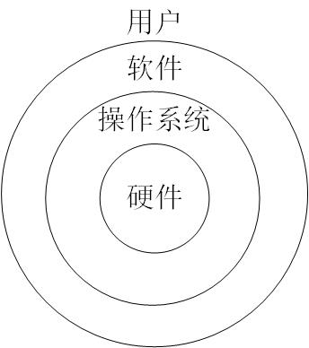

# 操作系统概述

## 操作系统资源的资源管理功能和目标

### 操作系统的定义

操作系统是管理计算机资源的一种系统软件。计算机系统中的资源主要分为**硬件资源**和**软件资源**。硬件资源主要包括：内存、外存、中央处理器（CPU）、输入/输出（I/O）设备。硬件通过主板连接在一起，可以相互通信，相互工作。软件资源主要包括：程序、数据和文档，这些资源存放在外存上，使用时复制到内存。

可以从操作系统资源管理的角度来学习操作系统的知识，包括：**处理器管理**（进程管理）、**存储管理**（管理硬件内存）、**设备管理**（管理输入/输出设备）、**文件管理**（管理程序、数据和文档）。

### 操作系统在计算机中的位置

操作系统是计算机系统的重要组成部分，计算机系统大体可以分为如下四层结构，自底向上分别为：硬件、操作系统、应用软件和用户。操作系统位于硬件之上，应用软件之下，起着承上启下的作用。

